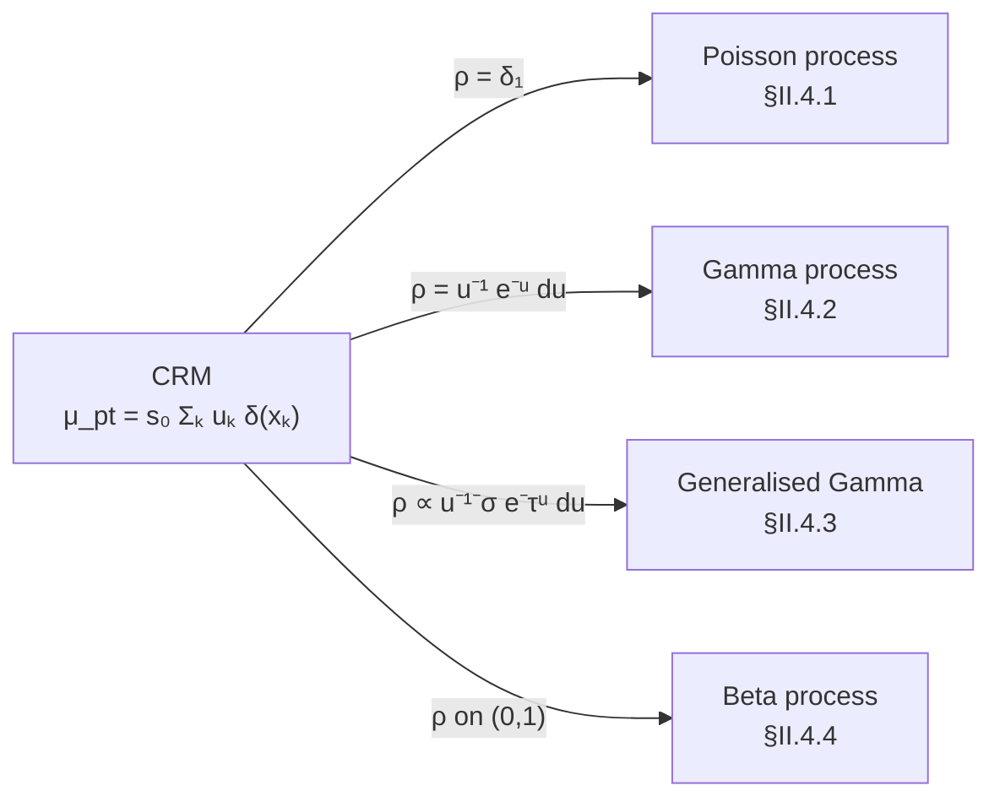
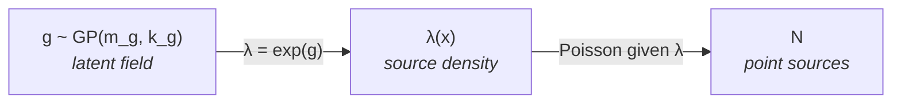
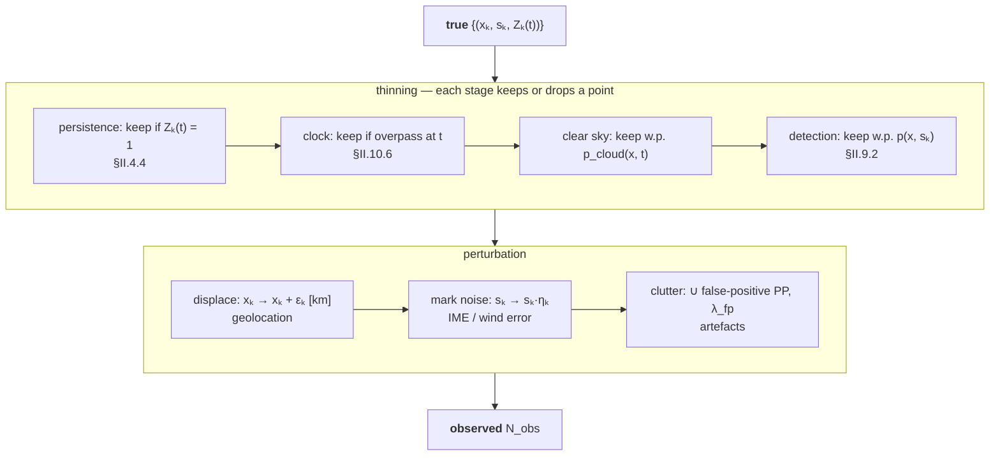
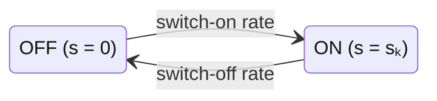

# Part II — Building the mathematical objects

Each section introduces **exactly one new idea** and names the phase it serves.

| § | Object | Serves |
|---|---|---|
| [II.1](#ii-1) | Measures and the point/area split | all phases |
| [II.2](#ii-2) | Random measures, complete randomness | all phases |
| [II.3](#ii-3) | Poisson process | A |
| [II.4](#ii-4) | Completely random measures (Poisson, Gamma, generalised Gamma, Beta) | C (B for Beta) |
| [II.5](#ii-5) | Normalisation: Dirichlet and Pitman–Yor processes | C |
| [II.6](#ii-6) | Random fields, Gaussian processes | A, C |
| [II.7](#ii-7) | Cox process | A |
| [II.8](#ii-8) | Scale: coarsening, transport, averaging | all phases |
| [II.9](#ii-9) | Thinning and the full observation operator | A, B |
| [II.10](#ii-10) | Time | B, C |

---

## II.1 Regions and measures — and the point/area split *(all phases)* {#ii-1}

Region
:   $A \subset S$ is any subset you could draw on a map.

Pairwise disjoint
:   $A_1,\dots,A_n$ with $A_i \cap A_j = \varnothing$ for $i \neq j$. Adjacent cells: disjoint. A cell and the basin containing it: not.

Partition
:   Pairwise-disjoint regions whose union is $S$. The $2 \times 2$ grid of [§I.5](01_problem.md#i-5 "The running example") is one.

Measure
:   $m$ assigns to each region $A$ a number $m(A) \ge 0$ with $m(\varnothing) = 0$ and additivity over pairwise-disjoint regions:

    $$
    m(A_1 \cup A_2 \cup \cdots) = m(A_1) + m(A_2) + \cdots
    $$

    *Measures on $S$:* area $\lvert A\rvert$; emission rate $\mu(A)$; source count $N(A)$.
    *Not measures:* max rate in $A$; mean $\mathrm{XCH_4}$ over $A$.

Point mass
:   $\delta_x(A) = 1$ if $x \in A$, else $0$.

!!! abstract "The point/area split rests on a theorem about measures"
    Any (σ-finite) emission measure decomposes **uniquely** into three parts:[^lebesgue]

    $$
    \mu = \mu_{\mathrm{atomic}} + \mu_{\mathrm{ac}} + \mu_{\mathrm{sc}}
    $$

    atoms at points, an absolutely continuous part with a density over area, and a singular-continuous remainder (mass on a curve such as a pipeline). As a **modelling choice** we fold $\mu_{\mathrm{sc}}$ into whichever of the other two suits the instrument, and work with the two-part representation

    $$
    \mu(A) = \mu_{\mathrm{pt}}(A) + \mu_{\mathrm{df}}(A)
    $$

    $$
    \mu_{\mathrm{pt}}(A) = \sum_{k:\,x_k \in A} s_k
    \qquad\text{(point sources: atoms at } x_k \text{ with weights } s_k\text{)}
    $$

    $$
    \mu_{\mathrm{df}}(A) = \int_A e(x)\,\mathrm{d}x
    \qquad\text{(area sources: a flux density } e(x) \text{ in } \mathrm{kg\,h^{-1}\,km^{-2}}\text{)}
    $$

    Once $\mu_{\mathrm{sc}}$ has been folded in, this split is an approximation we chose, not a unique decomposition.

???+ example "Running example"
    $$
    \begin{aligned}
    \mu_{\mathrm{pt}}(A_1) &= 120 & \mu_{\mathrm{df}}(A_1) &= 0\\
    \mu_{\mathrm{pt}}(A_2) &= 35 & \mu_{\mathrm{df}}(A_2) &= 400 \ \text{(field } D)\\
    \mu_{\mathrm{pt}}(A_3) &= 410 & \mu_{\mathrm{df}}(A_3) &= 0\\
    \mu_{\mathrm{pt}}(A_4) &= 60 & \mu_{\mathrm{df}}(A_4) &= 0\\[4pt]
    \mu(S) &= 625 + 400 = 1025\ \mathrm{kg\,h^{-1}} & &\text{(instantaneous, all on)}
    \end{aligned}
    $$

**Why the split matters for modelling.** Atoms are described by a *point process* ([§II.3](#ii-3)–[§II.5](#ii-5)). A density $e(x)$ is a *field* ([§II.6](#ii-6)). They are different random objects and get different priors. Everything else in this section is organised around that fact.

[^lebesgue]: The Lebesgue decomposition, with respect to area, into atomic, absolutely continuous, and singular-continuous parts.

## II.2 Randomising the inventory *(all phases)* {#ii-2}

**Random measure.** Before looking at data, the number, locations, rates, and density are unknown. A random measure is a random variable whose *value* is an entire measure; for each fixed $A$, $\mu(A)$ is an ordinary positive random variable.

**Complete randomness — the one structural assumption.** $\mu$ is *completely random* if for any pairwise-disjoint $A_1,\dots,A_n$, the totals $\mu(A_1),\dots,\mu(A_n)$ are mutually independent. Learning $A_1$ tells you nothing about $A_2$.

!!! warning "Critical note"
    Physically false for adjacent cells (shared geology, operators, gathering lines). We keep the assumption because it makes the building blocks tractable; [§II.7](#ii-7 "The Cox process") repairs it.

## II.3 Counting point sources — the Poisson process *(Phase A)* {#ii-3}

Ignore rates. $N(A)$ is a *Poisson process with intensity measure $\lambda$* if

1. $N(A) \sim \mathrm{Poisson}(\lambda(A))$, where $\lambda(A)$ is the expected number of sources in $A$;
2. counts in pairwise-disjoint regions are independent.

With density: $\lambda(A) = \int_A \lambda(x)\,\mathrm{d}x$, $\lambda(x)$ in $\mathrm{km^{-2}}$. **Homogeneous:** $\lambda$ constant. **Inhomogeneous:** high over active fields, $\approx 0$ over rangeland.

???+ example "Running example"
    Suppose $\lambda(x) = 0.05\ \mathrm{km^{-2}}$ over active acreage, $0.002\ \mathrm{km^{-2}}$ elsewhere. $A_1$ ($400\ \mathrm{km^2}$, mostly active) has $\lambda(A_1) \approx 15$: we expect about 15 point sources there, standard deviation $\approx 4$.

    Our four "true" sources are the ones large enough to matter; the Poisson prior also expects many tiny ones (see [§II.4](#ii-4)).

$N$ is itself a completely random measure: the case where every atom weighs 1.

## II.4 Attaching rates — the completely random measure *(Phase C)* {#ii-4}

Work with **dimensionless marks** $u_k = s_k/s_0$, so that the physical rate is $s_k = s_0 u_k$. Treat the pairs $(x_k, u_k)$ as a Poisson process on $S \times (0,\infty)$ with intensity

$$
\nu(\mathrm{d}x, \mathrm{d}u) = \lambda(\mathrm{d}x)\,\rho(\mathrm{d}u)
$$

*Reading.* $\nu(A \times [a,b])$ = expected number of sources in $A$ with rate in $[a s_0, b s_0]$. $\lambda$ handles **where**, $\rho$ handles **how big**.

**What $\rho$ is.** Not a probability density. $\rho(\mathrm{d}u)$ is the expected number of sources, per unit of $\lambda$, with dimensionless rate in $\mathrm{d}u$. It may have infinite mass near $0$; what is required is

$$
\int_0^\infty \min(u, 1)\,\rho(\mathrm{d}u) < \infty
$$

Infinitely many negligible sources, finite total. This is the nonparametric part: **the number of sources is never fixed.**

The atomic random measure is $\mu_{\mathrm{pt}}(A) = \sum_{k:\,x_k\in A} s_k = s_0 \sum_{k:\,x_k\in A} u_k$, and its law in every region follows from $\rho$ via the Laplace functional (for dimensionless $\theta \ge 0$)

$$
\mathbb{E}\!\left[\exp\!\left(-\theta\,\frac{\mu_{\mathrm{pt}}(A)}{s_0}\right)\right]
= \exp\!\left(-\lambda(A)\int_0^\infty \bigl(1 - e^{-\theta u}\bigr)\,\rho(\mathrm{d}u)\right)
$$

The choice of Lévy measure $\rho$ selects the member of the family:



### II.4.1 Poisson process {#ii-4-1}

$\rho = \delta_1$. Every atom weighs 1; $\mu_{\mathrm{pt}}(A)/s_0 = N(A)$. A prior over **counts**.

### II.4.2 Gamma process — inventory prior with light tails {#ii-4-2}

Take a prior inventory $H$ ($\mathrm{kg\,h^{-1}}$ per region, e.g. from a bottom-up product) and set $\lambda(\mathrm{d}x) = H(\mathrm{d}x)/s_0$ and $\rho(\mathrm{d}u) = u^{-1}e^{-u}\,\mathrm{d}u$. Then

$$
\frac{\mu_{\mathrm{pt}}(A)}{s_0} \sim \mathrm{Gamma}\!\left(\text{shape}=\frac{H(A)}{s_0},\ \text{rate}=1\right),
\qquad
\mathbb{E}[\mu_{\mathrm{pt}}(A)] = H(A)
$$

???+ example "Running example"
    $H(A_3) = 500\ \mathrm{kg\,h^{-1}}$ gives $\mu_{\mathrm{pt}}(A_3)/s_0 \sim \mathrm{Gamma}(500, 1)$: mean 500, standard deviation $\approx 22\ \mathrm{kg\,h^{-1}}$. The true 410 sits $(500 - 410)/22 \approx 4$ standard deviations below the mean: this prior all but rules the truth out.

!!! warning "Critical notes"
    - **Rate $= 1$ forces $\mathrm{Var} = \mathbb{E}\cdot s_0$**, which is arbitrary. Add a dispersion $\theta_d$ (shape $H/(\theta_d s_0)$, rate $1/\theta_d$).
    - **The $e^{-u}$ tail forbids super-emitters.** A prior standard deviation of $22\ \mathrm{kg\,h^{-1}}$ on a cell whose true content is dominated by one $410\ \mathrm{kg\,h^{-1}}$ source is overconfident about the wrong thing.

### II.4.3 Generalised Gamma — inventory prior with super-emitters {#ii-4-3}

$$
\rho(\mathrm{d}u) \propto u^{-1-\sigma} e^{-\tau u}\,\mathrm{d}u,
\qquad \sigma \in (0,1),\ \tau \ge 0
$$

Power-law body, exponential cut-off at scale $1/\tau$.

| Limit | Result |
|---|---|
| $\sigma \to 0$ | recovers the Gamma process |
| $\tau \to 0$ | pure $\sigma$-stable law: infinite mean, **too heavy** |
| $\sigma \in (0,1),\ \tau > 0$ | tempered stable: heavy body, finite mean. **Use this.** |

???+ example "Running example"
    Source 3 is 66 % of $\mu_{\mathrm{pt}}(S)$. A Gamma prior calls that an outlier; a tempered-stable prior with $\sigma \approx 0.5$ expects exactly this shape.

### II.4.4 Beta process — persistence prior *(Phase B)* {#ii-4-4}

$$
\rho(\mathrm{d}\pi) = c\, \pi^{-1}(1-\pi)^{c-1}\,\mathrm{d}\pi \ \text{ on } (0,1),
\qquad \lambda = B_0
$$

Every atom is now a **probability** $\pi_k \in (0,1)$: the fraction of time source $k$ is on. For overpass $i$ draw $Z_{ik} \sim \mathrm{Bernoulli}(\pi_k)$:

| | src 1 | src 2 | src 3 | src 4 |
|---|:---:|:---:|:---:|:---:|
| pass 1 | :material-circle: | :material-circle: | :material-circle-outline: | :material-circle: |
| pass 2 | :material-circle: | :material-circle: | :material-circle: | :material-circle: |
| pass 3 | :material-circle: | :material-circle: | :material-circle-outline: | :material-circle: |
| pass 4 | :material-circle-outline: | :material-circle: | :material-circle-outline: | :material-circle: |
| pass 5 | :material-circle: | :material-circle: | :material-circle: | :material-circle: |
| **true $\pi_k$** | **0.9** | **1.0** | **0.3** | **1.0** |

The overpass $\times$ source matrix $Z$ (filled = on, hollow = off) is the *feature allocation*; $c$ controls how many sources are persistent versus flickering. Integrating out the $\pi_k$ gives the IBP on $Z$.[^ibp]

**Known candidate sites — the finite version.** When the infrastructure database supplies candidate coordinates $c_1,\dots,c_J$, there is nothing nonparametric about *those*: model each with $Z_j \sim \mathrm{Bernoulli}(\pi_j)$, $\pi_j \sim \mathrm{Beta}(a,b)$. The Beta *process* is what you still need for sources *not* in the database (unknown-unknowns), and the Poisson/Cox process ([§II.3](#ii-3), [§II.7](#ii-7)) for their locations.

<div class="grid" markdown>

!!! success "Known-unknowns → Phase B"
    - sites $c_j$ **given**
    - state $Z_j$ random
    - finite Beta–Bernoulli

!!! question "Unknown-unknowns → Phase A"
    - sites **random**
    - state *and* site random
    - Poisson/Cox + Beta process

</div>

[^ibp]: Griffiths & Ghahramani's Indian Buffet Process: the exchangeable distribution over binary feature matrices with an unbounded number of columns.

## II.5 Fractions and attribution — normalisation *(Phase C)* {#ii-5}

If $0 < \mu_{\mathrm{pt}}(S) < \infty$, then $G(A) = \mu_{\mathrm{pt}}(A)/\mu_{\mathrm{pt}}(S)$ is the fraction of the basin's point total from $A$. For the Gamma process, ratios of independent Gammas are Dirichlet, so for any partition:

$$
\bigl(G(A_1),\dots,G(A_n)\bigr) \sim \mathrm{Dirichlet}\!\left(\frac{H(A_1)}{s_0},\dots,\frac{H(A_n)}{s_0}\right)
$$

This is the **Dirichlet process** $\mathrm{DP}(H)$.

???+ example "Running example"
    $H = (500, 150, 500, 200)\ \mathrm{kg\,h^{-1}}$ gives fractions centred on $(0.37, 0.11, 0.37, 0.15)$.

*Attribution reading.* Each detected plume is assigned to a source.

=== "Dirichlet process"

    The number of distinct sources is unbounded and grows like $\log n$ with $n$ plumes; a source already holding many plumes attracts the next (rich-get-richer).

=== "Pitman–Yor"

    $\mathrm{PY}(\sigma, \theta_{\mathrm{PY}})$ makes the count grow like $n^\sigma$, via stick-breaking:

    $$
    V_k \sim \mathrm{Beta}(1-\sigma,\ \theta_{\mathrm{PY}} + k\sigma),
    \qquad
    \pi_k = V_k \prod_{j<k}(1 - V_j)
    $$

    with $\sigma = 0$ recovering the DP.

Attribution matters when two plumes in one fine-imager scene could come from one source or two.

## II.6 Fields — for concentrations *and* for area sources *(Phases A, C)* {#ii-6}

Three quantities in this problem are **fields**, not measures:

| Field | Meaning | Units | Where |
|---|---|---|---|
| $f(x)$ | $\mathrm{XCH_4}$ enhancement | ppb | what the satellite retrieves |
| $e(x)$ | diffuse flux density | $\mathrm{kg\,h^{-1}\,km^{-2}}$ | area sources, [§II.1](#ii-1) |
| $g(x)$ | log source density | — | where point sources cluster, [§II.7](#ii-7) |

None of them is additive over regions. All three need the same construction.

**Random field.** Specify, for every finite set of locations $x_1,\dots,x_n$, the joint law of $(f(x_1),\dots,f(x_n))$, subject to *consistency*: integrating the $(n+1)$-point law over one coordinate must reproduce the $n$-point law. A consistent family determines a unique random function on $S$.[^kolmogorov] Consistency is what lets you say "*the* field".

**Gaussian process $\mathcal{GP}(m,k)$.**

$$
\bigl(f(x_1),\dots,f(x_n)\bigr) \sim \mathcal{N}(\mathbf{m}, \mathbf{K}),
\qquad m_i = m(x_i),\quad K_{ij} = k(x_i, x_j)
$$

with $k$ positive semi-definite. Consistency is automatic.

=== "Concentration field"

    !!! example "Running example"
        $f(x)$ with $k(x,x') = \sigma_f^2 \exp(-\lVert x - x'\rVert/\ell)$, $\sigma_f = 15$ ppb, $\ell = 20$ km. Pixels 10 km apart correlate at $e^{-0.5} \approx 0.61$. The posterior mean given scattered retrievals is kriging.

=== "Area source"

    !!! example "Running example"
        $\log e(x) \sim \mathcal{GP}$ with mean $\log(2\ \mathrm{kg\,h^{-1}\,km^{-2}})$ inside $D$, correlation length 5 km. Then $\mu_{\mathrm{df}}(A) = \int_A e(x)\,\mathrm{d}x$ is a *derived* random measure: additive, but built from a field.

        Its prior is log-normal-ish, not Gamma. That is fine: $\mu_{\mathrm{df}}$ and $\mu_{\mathrm{pt}}$ are different objects and the total $\mu = \mu_{\mathrm{pt}} + \mu_{\mathrm{df}}$ is simply their sum.

**Beyond Gaussian.**

Student-t process
:   Multivariate-$t$ finite-dimensional laws with common $\nu_t$; consistent; robust to outlier retrievals. $\nu_t \to \infty$ gives the GP.

Wishart process
:   $\Sigma(x) = A(x)A(x)^{\mathsf T}$ with GP columns; a spatially varying covariance across jointly retrieved species.

[^kolmogorov]: The Kolmogorov extension theorem.

## II.7 Composing field and point process — the Cox process *(Phase A)* {#ii-7}

Repair [§II.2](#ii-2 "Complete randomness")'s independence assumption: let the source density be a random field,

$$
\log\lambda(x) = g(x),\quad g \sim \mathcal{GP}(m_g, k_g);
\qquad
N \mid \lambda \sim \text{Poisson process with intensity } \lambda
$$



Given $\lambda$, disjoint cells are independent. **Marginally they are positively correlated**, because the same $g$ shaped both. This is the LGCP, and it is the natural *discovery* prior: detections in $A_1$ raise the posterior source density in adjacent $A_3$ before $A_3$ has been searched.

???+ example "Running example"
    With $k_g$'s correlation length 20 km, finding source 1 in $A_1$ raises $\mathbb{E}[N(A_3) \mid \text{data}]$ by a fraction set by $k_g(x_1, A_3)$; under plain Poisson it would not move.

## II.8 Scale — coarsening, transport, and averaging *(all phases)* {#ii-8}

This is where [§I.2](01_problem.md#i-2)'s "point versus area depends on the instrument" becomes mathematics.

### II.8.1 Spatial coarsening {#ii-8-1}

Define the coarsening operator for pixel size $\Delta x$:

$$
C_\Delta\,\mu = \bigl(\mu(P_1), \mu(P_2), \dots\bigr),
\qquad \{P_j\} \text{ the } \Delta x\text{-grid partition of } S
$$

$C_\Delta$ maps a measure to a vector of pixel totals in $\mathrm{kg\,h^{-1}}$. Two facts:

1. **Coarsening forgets the atomic/diffuse split.** $\mu(P_j) = \mu_{\mathrm{pt}}(P_j) + \mu_{\mathrm{df}}(P_j)$ is one number; a pixel containing twenty $20\ \mathrm{kg\,h^{-1}}$ pads is indistinguishable from a pixel with $400\ \mathrm{kg\,h^{-1}}$ of diffuse flux.
2. **A point source is an atom *relative to $\Delta x$*.** Source $k$ is "point" for an instrument if its physical extent $\ll \Delta x$ *and* it is the dominant contributor to $\mu(P_j)$ for its pixel; otherwise it is part of an aggregate.

<div class="grid" markdown>

```text title="Fine Δx (0.03 km)"
+---+---+---+---+
|   | o |   |   |   atoms resolve,
+---+---+---+---+   each in its
|   |   |   | o |   own pixel
+---+---+---+---+
→ point-process model
```

```text title="Coarse Δx (7 km)"
+---------------+
|  o    o       |   atoms merge
|     ::::::    |   with diffuse
|   :::::::     |   into one total
+---------------+
→ field model of C_Δ μ
```

</div>

???+ example "Running example"
    The coarse mapper's 7 km pixel over the north-east of $A_2$ contains source 2 ($35\ \mathrm{kg\,h^{-1}}$) and roughly a quarter of field $D$ ($100\ \mathrm{kg\,h^{-1}}$): $C_\Delta\mu \approx 135\ \mathrm{kg\,h^{-1}}$ for that pixel, and the mapper cannot tell the two apart. The fine imager *resolves* source 2 geometrically (its footprint would be a compact plume), but at $35\ \mathrm{kg\,h^{-1}}$ it is below the $\approx 100\ \mathrm{kg\,h^{-1}}$ detection limit, so it goes **undetected** ([§II.9.2](#ii-9-2)); field $D$ produces no plume at all. Resolution and detection are different properties.

!!! tip "Modelling consequence"
    At the coarse scale, model $C_\Delta\mu$ directly as a *gridded field* (e.g. a GP on log pixel totals) and let the point/area decomposition live at the fine scale only. The two scales are linked by linearity,

    $$
    C_\Delta(\mu_{\mathrm{pt}} + \mu_{\mathrm{df}}) = C_\Delta\mu_{\mathrm{pt}} + C_\Delta\mu_{\mathrm{df}},
    $$

    so a fine-scale posterior can always be coarsened for comparison with the mapper, **never the reverse**.

### II.8.2 Atmospheric transport — the field-side observation operator {#ii-8-2}

The satellite does not retrieve $\mu$; it retrieves $f$. The link is a transport operator

$$
f(x) = (\mathcal{T}\mu)(x) + f_{\mathrm{bg}}(x) + \varepsilon_r(x),
\qquad \varepsilon_r \sim \mathcal{N}(0, \sigma_r^2)
$$

where $\mathcal{T}$ convolves emissions with a plume kernel driven by wind $U$, and $f_{\mathrm{bg}}$ is background.

- For a single atom, $\mathcal{T}(s_k\delta_{x_k})$ is a **compact plume** of peak enhancement roughly $\propto s_k/U$.
- For a diffuse patch, $\mathcal{T}\mu_{\mathrm{df}}$ is a **broad, low enhancement**.

Per-plume rate estimation (IME and cross-sectional methods) is the local inversion of $\mathcal{T}$ for one atom; it returns a noisy $s_k\eta_k$ with $\eta_k$ log-normal ([§II.9.3](#ii-9-3)). In `plumax` the forward side of $\mathcal{T}$ is the Tier I–III dispersion models ([Gaussian plume/puff](../../design/01_tier1_gaussian.md), [Eulerian FV](../../design/03_tier3_eulerian.md)).

!!! warning "Critical note"
    $\mathcal{T}$ is linear in $\mu$, so a point source and an equal-total diffuse patch produce enhancements with the same **integral** but very different **peak**. Detection thresholds act on the peak. That is why $p(x,s)$ in [§II.9](#ii-9) is a property of point sources, and why area sources are found by *averaging* ([§II.8.3](#ii-8-3)), not by single-scene thresholding.

### II.8.3 Temporal scale — averaging and sampling {#ii-8-3}

Two time scales matter: the instrument revisit $\Delta t$, and the source's own on/off timescale.

**Time-averaged rate.** Over a window much longer than the on/off cycle,

$$
\bar{s}_k = \pi_k s_k \quad [\mathrm{kg\,h^{-1}}]
$$

This is the quantity an inventory wants; $s_k$ (the on-state rate) is what a single fine-imager scene measures.

=== "Averaging area sources"

    Retrieval noise $\sigma_r$ averages down as $1/\sqrt{n}$ over $n$ clear overpasses while a persistent diffuse enhancement does not, so area sources emerge from stacks that no single scene shows. The coarse mapper's daily revisit is what makes this work: 30 clear days gives noise $\approx \sigma_r/\sqrt{30} \approx 2$ ppb against a field-$D$ enhancement of a few ppb.

=== "Sampling intermittent point sources"

    The fine imager at $\Delta t = 5$ d *samples* $Z_k(t)$. If overpass times are independent of the source's state, the fraction of "on" scenes is an unbiased estimate of $\pi_k$.

    !!! danger "Sampling bias"
        If they are not (overpass at 10:30 local, blowdowns scheduled mornings) the estimate is biased and **no amount of data fixes it**.

???+ example "Running example — source 3"
    $s_3 = 410$, $\pi_3 = 0.3$, $\bar{s}_3 = 123\ \mathrm{kg\,h^{-1}}$. Ten fine-imager scenes, three showing a plume, each estimating $\approx 400 \pm 120\ \mathrm{kg\,h^{-1}}$, give $\hat\pi_3 = 0.3$, $\hat{s}_3 \approx 400$, $\hat{\bar{s}}_3 \approx 120\ \mathrm{kg\,h^{-1}}$. Good, *if* the ten overpasses are a fair sample of the source's schedule.

## II.9 Observing point sources — thinning and the full operator *(Phases A, B)* {#ii-9}

### II.9.1 Thinning {#ii-9-1}

**Definition.** Given a point process $N$ with points $\{x_k\}$ and a retention function $p: S \to [0,1]$, keep each $x_k$ independently with probability $p(x_k)$. The kept points form $N_{\mathrm{obs}}$.

!!! abstract "Thinning theorem"
    If $N$ is Poisson with intensity $\lambda$, then $N_{\mathrm{obs}}$ is Poisson with intensity $p\lambda$, and the kept and discarded points are **independent** Poisson processes.

???+ example "Running example"
    $\lambda(A_1) \approx 15$, $p \approx 0.3$ over $A_1$ on a given day, so $N_{\mathrm{obs}}(A_1) \sim \mathrm{Poisson}(4.5)$ and the undetected $\sim \mathrm{Poisson}(10.5)$, independent.

### II.9.2 Rate-dependent thinning and the detection limit {#ii-9-2}

Let the detection probability depend on the rate, writing $p(x,u)$ for a source at $x$ with rate $s = s_0 u$. A CRM with intensity $\lambda(\mathrm{d}x)\rho(\mathrm{d}u)$ is observed as

$$
\lambda(\mathrm{d}x)\,p(x,u)\,\rho(\mathrm{d}u)
$$

Take $p(u)$ to be the POD curve, rising around $s_{\min}/s_0$, and require

$$
\int_0^\infty p(u)\,\rho(\mathrm{d}u) < \infty .
$$

!!! warning "The detection curve must vanish fast enough near zero"
    For an infinite-activity $\rho$ (Gamma, generalised Gamma), a logistic curve in the *linear* rate has $p(0) > 0$, so $\int p\,\rho$ diverges and the model "observes" infinitely many sources. Use a hard cutoff, or a curve in $\log u$ whose decay near $0$ beats the blow-up of $\rho$.

Under that condition:

1. $\rho_{\mathrm{obs}} = p\rho$ has **finite mass**: you observe finitely many sources. "Infinitely many" was about the truth, never the data.
2. The observed total is biased low by the factor

    $$
    \frac{\int u\,p(u)\,\rho(\mathrm{d}u)}{\int u\,\rho(\mathrm{d}u)}
    $$

    This is the below-detection-limit gap, in one line.

???+ example "Running example"
    Fine imager, $s_{\min} \approx 100\ \mathrm{kg\,h^{-1}}$: sources 2 and 4 (35, 60) are essentially invisible; sources 1 and 3 are visible when on. Observable point total $\approx 530$ of $625\ \mathrm{kg\,h^{-1}}$ instantaneous, and a *further* factor of $\pi_k$ once averaged.

### II.9.3 The full observation operator for point sources {#ii-9-3}



Each stage preserves Poisson-ness (thinning theorem; displacement theorem; superposition), so the whole operator is tractable.

**Three differences from a data-assimilation $\mathcal{H}$:**

1. **Random**, not deterministic.
2. **Dimension-changing.**
3. **Not invertible.** Only the *product* of the four thinning probabilities with $\lambda$ is identifiable. Separating "source off", "not overhead", "cloudy", and "too small" requires each $p$ calibrated *outside* the data: controlled releases, orbit files, cloud masks.

!!! danger "Critical consequence for Phase B"
    An intermittency estimate $\hat\pi_k$ with no detection model is an estimate of $\pi_k \cdot p(x_k, s_k) \cdot p_{\mathrm{cloud}}$, **not** of $\pi_k$.

## II.10 Time *(Phases B, C)* {#ii-10}

Nothing above required $X$ to be spatial. Time adds **order**.

### II.10.1 Cumulative view — subordinators {#ii-10-1}

Model discrete releases at $t_k$ with masses $m_k$ [kg]:

$$
M(t) = \sum_{k:\,t_k \le t} m_k
$$

$M$ is always nondecreasing. It is a *subordinator* (independent, stationary increments, i.e. a CRM on the time axis) **only if** the pairs $(t_k, m_k)$ form a Poisson random measure with time-homogeneous intensity $\mathrm{d}t\,\rho(\mathrm{d}m)$, so that release times carry no memory and no seasonality. Under that assumption: Poisson gives a counting process; Gamma gives the Gamma subordinator; stable gives rare huge jumps.

Renewal, Hawkes, and time-varying intensities ([§II.10.2](#ii-10-2)) break the assumption, and then $M(t)$ is not a subordinator.

### II.10.2 Conditional intensity — history dependence {#ii-10-2}

$$
\lambda^*(t) = \lim_{\mathrm{d}t \to 0} \frac{P(\text{event in } [t, t+\mathrm{d}t) \mid \mathcal{H}_t)}{\mathrm{d}t} \quad [\mathrm{d^{-1}}]
$$

Poisson: $\lambda^*$ ignores $\mathcal{H}_t$ (memoryless). Others:

=== "Renewal"

    $$
    \lambda^*(t) = h(t - t_{\mathrm{last}})
    $$

    Regular schedules (blowdowns every $\approx 7$ d) are **under-dispersed** relative to Poisson.

=== "Hawkes"

    $$
    \lambda^*(t) = \lambda_0 + \sum_{t_i < t} \varphi(t - t_i),
    \qquad \varphi \ge 0,\ \int\varphi < 1
    $$

    Each emission *initiation* raises the near-term rate of new, distinct initiations: a process upset that triggers follow-on venting, or cascading equipment failures.

    A single leak that stays on until repair is **not** a Hawkes process. It is one initiation followed by an on-state duration, modelled with the switching process of [§II.10.4](#ii-10-4). Repeat satellite detections of the same leak are observations of that state, not new events.

=== "Cox in time"

    $$
    \log\lambda(t) \sim \mathcal{GP}
    $$

    The temporal analogue of [§II.7](#ii-7).

One likelihood covers all:

$$
\log L = \sum_i \log\lambda^*(t_i) - \int_0^{T_{\mathrm{end}}} \lambda^*(t)\,\mathrm{d}t
$$

!!! warning "Critical note"
    Space has no order, so no $\lambda^*$. Spatial clustering uses a latent field ([§II.7](#ii-7)); temporal clustering may use explicit triggering.

### II.10.3 GPs in time are SDEs — the Kalman link {#ii-10-3}

Matérn GPs over $t$ with **half-integer** smoothness $\nu = p + \tfrac12$ are exactly linear SDEs with a $(p+1)$-dimensional state. General $\nu$ has no finite state-space form. The simplest case, $\nu = \tfrac12$, with $W$ standard Brownian motion:

$$
k(t,t') = \sigma_f^2 \exp\!\left(-\frac{\lvert t - t'\rvert}{\ell_t}\right)
\quad\Longleftrightarrow\quad
\mathrm{d}f = -\frac{1}{\ell_t} f\,\mathrm{d}t + \sqrt{\frac{2\sigma_f^2}{\ell_t}}\,\mathrm{d}W
$$

(Ornstein–Uhlenbeck). For these kernels GP smoothing becomes a Kalman filter + smoother, $O(n)$. Squared-exponential kernels (and Matérn with non-half-integer $\nu$) get no exact such structure, only approximations.

!!! info
    The background prior in a Kalman/4D-Var system is a GP in disguise. See the `plumax.assimilation` scaffolding and [pipekit-cycle](https://github.com/jejjohnson/pipekit) for the data-assimilation side.

### II.10.4 Space × time {#ii-10-4}

$X = S \times T$. Kernels are separable ($k_S \cdot k_T$) or non-separable; the advective kernel depends on $x - x' - v(t - t')$ with $v = 86.4\,U\ \mathrm{km\,d^{-1}}$, a plume carried by the wind. Per-source rate functions $s_k(t)$: the continuous-time version of [§II.4.4](#ii-4-4) is a two-state Markov (or semi-Markov, for non-exponential durations) switching process. This is the right model for a leak that stays on until repair: the on-state duration is the repair time.



### II.10.5 Clustering over time {#ii-10-5}

Dependent DP: stick-breaking with time-varying $V_k(t)$, so attribution fractions drift smoothly instead of being re-estimated monthly.

### II.10.6 The observation clock is a thinned point process {#ii-10-6}

Overpass times form a point process on $T$ (deterministic per satellite, near-Poisson for a constellation), thinned by cloud. That is the "clock" and "clear sky" stages of [§II.9.3](#ii-9-3), seen from the time axis.
