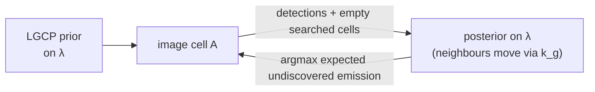

# Part III — Mapping the objects onto the three phases

Each phase gets the same four headings: **what is random**, the **object** from [Part II](02_objects.md) that describes it, the **data** it consumes, and what falls out.

## III.1 Phase A — Discovery {#iii-1}

**What is random**
:   Locations of sources not in the database

**Object**
:   Thinned log-Gaussian Cox process ([§II.7](02_objects.md#ii-7) + [§II.9](02_objects.md#ii-9))

**Data**
:   Fine-imager scenes over searched cells; the infrastructure database; the bottom-up inventory as the GP mean $m_g$

Discovery counts **sources**, so it needs a finite number of them. Restrict attention to sources above a size floor $u_{\mathrm{floor}}$ (well below $s_{\min}/s_0$), let $\lambda$ be the intensity of those sources, and give them the normalised mark distribution

$$
f(\mathrm{d}u) = \frac{\rho(\mathrm{d}u)\,\mathbf{1}[u \ge u_{\mathrm{floor}}]}{\rho([u_{\mathrm{floor}}, \infty))}.
$$

Let $p(x,u)$ be the probability that a source at $x$ with on-state rate $s_0 u$ has been detected by the searches so far (overpass, cloud, persistence and POD combined), and $\bar p(x) = \int p(x,u)\,f(\mathrm{d}u)$ its mark average.

!!! abstract "The central identity"
    By the (marked) thinning theorem, on a searched cell $A$, **conditional on the intensity** $\lambda$:

    $$
    \begin{aligned}
    N_{\mathrm{det}}(A) \mid \lambda &\sim \mathrm{Poisson}\!\left(\int_A \bar p(x)\,\lambda(\mathrm{d}x)\right),\\
    N_{\mathrm{miss}}(A) \mid \lambda &\sim \mathrm{Poisson}\!\left(\int_A \bigl(1-\bar p(x)\bigr)\,\lambda(\mathrm{d}x)\right),
    \qquad \text{independent given } \lambda
    \end{aligned}
    $$

    Under the LGCP, $\lambda$ is random, and marginally the two counts are **dependent** through it. That dependence is exactly what lets detections (and empty searched cells) inform the posterior over $\lambda$, and hence the expected number missed. Write the likelihood conditionally on $\lambda$ and integrate over $\lambda$; never factor the marginal.

So the posterior over $\lambda$ updates from **both** detections **and** searched-but-empty cells, and the expected number still undiscovered (above the floor) is

$$
\int_A \bigl(1 - \bar p(x)\bigr)\,\lambda(\mathrm{d}x)
$$

computable, not guessed.

!!! warning "Why the floor"
    With the infinite-activity priors of [§II.4](02_objects.md#ii-4), $\int (1-p)\,\rho = \infty$: the missed source **count** is infinite, even though the missed **mass** is finite. Counting questions (Phase A) therefore need the floor, and mass questions (Phase C, [§III.3](#iii-3)) are posed directly on the missed mass, with no floor.

**Search strategy falls out.** The next cell to image is the one maximising the posterior expected emission that is still undiscovered **and** that the next image would detect,

$$
s_0\,\mathbb{E}\!\left[\int_A \int u\,\bigl(1 - p(x,u)\bigr)\,p_{\mathrm{next}}(x,u)\,f(\mathrm{d}u)\,\lambda(\mathrm{d}x)\right]
$$

which weights high posterior density (Cox correlation from neighbours) against what the instrument can actually see.



???+ example "Running example"
    After one clear fine-imager scene over $A_1$ detecting source 1: $N_{\mathrm{obs}}(A_1) = 1$ against a prior mean of 4.5 detectable, so the posterior $\lambda(A_1)$ drops; the Cox prior propagates a milder drop to $A_3$; $A_2$ and $A_4$ are unsearched and unchanged. Expected undiscovered in $A_1 \approx (1 - \bar p)\,\hat\lambda(A_1)$ with mark-averaged $\bar p \approx 0.3$.

## III.2 Phase B — Monitoring {#iii-2}

**What is random**
:   The on/off state and timing of *known* sources

**Object**
:   Per-site Beta–Bernoulli persistence ([§II.4.4](02_objects.md#ii-4-4)), a temporal point process of initiations ([§II.10.2](02_objects.md#ii-10-2)), or an on/off switching process ([§II.10.4](02_objects.md#ii-10-4)), observed through the thinned clock ([§II.9.3](02_objects.md#ii-9-3), [§II.10.6](02_objects.md#ii-10-6))

**Data**
:   The sequence of (overpass, cloud, detected, rate) for each known site

**Model choice by physics.**

| Physical behaviour | Model | Key parameter |
|---|---|---|
| scheduled venting | renewal | $h$ peaked at 7 d |
| leak until repair | two-state (semi-)Markov switching ([§II.10.4](02_objects.md#ii-10-4)) | on-state duration = repair time |
| clustered distinct initiations (upsets, cascades) | Hawkes | $\varphi$ decaying over days |
| random operations | Beta–Bernoulli | $\pi_k$ |

!!! danger "The identifiability warning"
    With $n$ overpasses, $n_{\mathrm{clear}}$ clear, $n_{\mathrm{det}}$ detections at site $k$:

    $$
    \frac{n_{\mathrm{det}}}{n_{\mathrm{clear}}} \ \text{ estimates } \ \pi_k \cdot p(x_k, s_k),
    \quad \text{not } \pi_k
    $$

    Use the controlled-release detection curve to divide out $p$; otherwise report the product and say so.

???+ example "Running example — source 3"
    10 overpasses, 8 clear, 3 detections at $\approx 400\ \mathrm{kg\,h^{-1}}$. With $p(400\ \mathrm{kg\,h^{-1}}) \approx 0.9$ from the detection curve:

    $$
    \hat\pi_3 \approx \frac{3/8}{0.9} \approx 0.42
    $$

    against a truth of 0.3. The discrepancy is sampling noise on 8 scenes, and a $\mathrm{Beta}(1,1)$ prior gives a 90 % interval of roughly $(0.15, 0.7)$. Renewal structure would tighten this if the blowdowns are regular.

## III.3 Phase C — Estimation of rates and total {#iii-3}

**What is random**
:   The on-state rates $s_k$, the diffuse density $e(x)$, and their sums

**Object**
:   The full measure $\mu = \mu_{\mathrm{pt}} + \mu_{\mathrm{df}}$ with a heavy-tailed CRM prior on $\mu_{\mathrm{pt}}$ ([§II.4.3](02_objects.md#ii-4-3)), a log-GP prior on $e$ ([§II.6](02_objects.md#ii-6)), and the per-plume observation model ([§II.8.2](02_objects.md#ii-8-2), [§II.9.3](02_objects.md#ii-9-3))

!!! abstract "Decomposition of the basin total"
    Time-averaged,

    $$
    \begin{aligned}
    \bar\mu(S)
    = {}& \underbrace{\sum_{k\ \mathrm{detected}} \pi_k s_k}_{\text{(i) monitored points}}\\
    & + \underbrace{s_0\,\mathbb{E}\!\left[\int_S \int_0^\infty\!\!\int_0^1 \pi\,u\,\bigl(1 - p_{\mathrm{camp}}(x,u,\pi)\bigr)\,G(\mathrm{d}\pi \mid u)\,\rho(\mathrm{d}u)\,\lambda(\mathrm{d}x)\right]}_{\text{(ii) undiscovered points}}\\
    & + \underbrace{\int_S e(x)\,\mathrm{d}x}_{\text{(iii) diffuse}}
    \end{aligned}
    $$

    Each source carries two marks: its **on-state** rate $s_0 u$ (as in [§II.4](02_objects.md#ii-4), the quantity the POD acts on) and its persistence $\pi$, with conditional distribution $G(\mathrm{d}\pi \mid u)$. Its time-averaged contribution is $\pi s_0 u$. Detection over the campaign depends on both marks: with $n$ clear scenes and independent on/off states,

    $$
    p_{\mathrm{camp}}(x,u,\pi) = 1 - \bigl(1 - \pi\,p(x,u)\bigr)^{n}.
    $$

    Term (ii) integrates the missed time-averaged emission $\pi u\,(1-p_{\mathrm{camp}})$ jointly over location, rate and persistence. Sources 2 and 4 have $p \approx 0$ and fall entirely into (ii). Source 3 is intermittent but bright: $1 - (1 - 0.3 \times 0.9)^{8} \approx 0.92$, so it is almost surely found, even though its time-averaged $123\ \mathrm{kg\,h^{-1}}$ is near the threshold. Collapsing it to one averaged rate would wrongly place it in (ii).

Each term has its own uncertainty:

=== "(i) Monitored points"

    Per-plume rate noise $\eta_k$ (log-normal, tens of percent) $\times$ persistence uncertainty from [§III.2](#iii-2).

=== "(ii) Undiscovered points"

    Driven by the **tail** of $\rho$ below $s_{\min}$. This is where the choice of Gamma versus generalised Gamma changes the answer by a large factor, and the only handle on it is bottom-up knowledge of small-source rates.

=== "(iii) Diffuse"

    From the coarse-mapper stack; scales as $\sigma_r/\sqrt{n_{\mathrm{clear}}}$.

???+ example "Running example"
    | Term | Estimate ($\mathrm{kg\,h^{-1}}$) | Note |
    |---|---|---|
    | (i) monitored | $0.9\cdot 120 + 0.3\cdot 410 = 231$ | sources 1, 3; $\pm\approx 30\,\%$ each |
    | (ii) undiscovered | sources 2, 4 + tail $\approx 95 +$ prior tail | truth 95; known only via $\rho$ below $100\ \mathrm{kg\,h^{-1}}$ |
    | (iii) diffuse | $\approx 400 \pm 60$ | 30-day mapper stack |
    | **total** | $\approx 726$ (truth 726) | **(ii) is set by the prior, not the data** |

    ```mermaid
    %%{init: {"themeVariables": {"pie1": "#00695c", "pie2": "#26a69a", "pie3": "#80cbc4", "pie4": "#b2dfdb", "pie5": "#ffb74d", "pieStrokeColor": "#ffffff", "pieOuterStrokeColor": "#9e9e9e", "pieTitleTextColor": "#8a8a8a", "pieLegendTextColor": "#8a8a8a", "pieSectionTextColor": "#ffffff"}}}%%
    pie showData title Where the 726 kg/h comes from
        "(i) monitored points" : 231
        "(ii) undiscovered points" : 95
        "(iii) diffuse" : 400
    ```

**Attribution.** When two fine-imager plumes are near each other, DP/Pitman–Yor ([§II.5](02_objects.md#ii-5)) decides "one source or two", with the rich-get-richer prior favouring the known large one. Pitman–Yor is the safer choice given the heavy tail.

!!! tip "In `plumax`"
    The population-level machinery for this phase (TMTPP, POD-corrected totals, the missing-mass paradox) is laid out in [Tier V.D — Total emission estimation](../../design/06d_total_emission.md).

## III.4 Scale summary {#iii-4}

| | point (atom) | area (density) |
|---|---|---|
| **object** | $\mu_{\mathrm{pt}} = \sum_k s_k\delta_{x_k}$ | $\mu_{\mathrm{df}} = \int e\,\mathrm{d}x$ |
| **prior** | CRM (Gamma / GGP / Beta) | log-GP on $e$ |
| **seen by** | fine imager, 1 scene | coarse mapper, stack |
| **detection** | threshold on peak | averaging, $1/\sqrt{n}$ |
| **time** | sampled: $\pi_k s_k$ | averaged: persistent |
| **phase** | A, B, C | C |
| **fails when** | extent $\gtrsim \Delta x$ | extent $\lesssim \Delta x$ |

## III.5 The assumptions carrying the structure {#iii-5}

| # | Assumption | Fails when | Repaired by |
|:---:|---|---|---|
| 1 | *Independence across disjoint regions* ([§II.2](02_objects.md#ii-2)) | shared geology | Cox process ([§II.7](02_objects.md#ii-7)) |
| 2 | *Memorylessness in time* ([§II.10.2](02_objects.md#ii-10-2), Poisson) | persistent leaks, schedules, clustered upsets | on/off switching (leaks), renewal (schedules), Hawkes (clustered initiations) |
| 3 | *Point/area is fixed* | always: it is relative to $\Delta x$ ([§II.8.1](02_objects.md#ii-8-1)) | model at the fine scale and coarsen, never the reverse |
| 4 | *Overpasses are a fair sample of source state* ([§II.8.3](02_objects.md#ii-8-3)) | operations correlate with local overpass time | no fix from data alone |

!!! quote "The identifiability warning that runs through all three phases"
    The data see only products ($p\lambda$, $\pi_k p$, $\int u\,p(u)\,\rho(\mathrm{d}u)$), and **everything below the detection limit rests on calibration done outside the model.**
