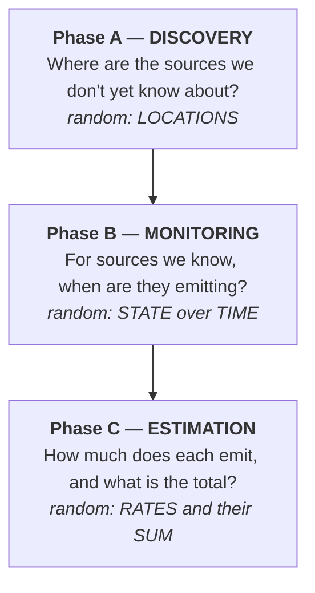

# From Satellite Detections to a Methane Inventory

**The real problem first, then the mathematics needed to describe it, with one running example carried to the end.**

A methane inventory has to answer three questions about a basin: *where* are the sources, *when* are they emitting, and *how much* do they emit in total. Satellites answer none of them directly. They return thinned, noisy, scale-dependent snapshots, and the gap between those snapshots and an inventory is where the mathematics lives.

This section is the theory behind [Tier V — Source population](../../design/06_tier5_population.md "Tier V design"). It builds, one idea at a time, the random objects (point processes, completely random measures, Gaussian processes, Cox processes, thinning) that describe the problem, then maps them back onto the three phases of inventory work.

## The task, in three phases

The three phases need different mathematical objects because **a different thing is uncertain in each**. Part II builds those objects; Part III maps them back onto the phases.

## How this section is organised

-   :material-satellite-variant:{ .lg .middle } **Part I — The real problem and the real data**

    ---

    Point versus area sources, what the instruments measure, the data products, and the Permian running example used throughout.

    [:octicons-arrow-right-24: Part I](01_problem.md)

-   :material-function-variant:{ .lg .middle } **Part II — Building the mathematical objects**

    ---

    Measures, Poisson processes, completely random measures, fields, Cox processes, scale, thinning, and time, each introduced with the phase it serves.

    [:octicons-arrow-right-24: Part II](02_objects.md)

-   :material-map-marker-path:{ .lg .middle } **Part III — Mapping onto the three phases**

    ---

    Discovery, monitoring, and estimation of the basin total, with the running example worked to a number and the assumptions made explicit.

    [:octicons-arrow-right-24: Part III](03_phases.md)

-   :material-scale-balance:{ .lg .middle } **Scale summary**

    ---

    Point (atom) versus area (density), side by side: the prior, the instrument, the detection mechanism, and when each model fails.

    [:octicons-arrow-right-24: Summary table](03_phases.md#iii-4)

## Reading guide

Each object in Part II is tagged with the phase(s) it serves. If you care about one phase only, follow its thread:

=== "Phase A — Discovery"

    [Regions & measures](02_objects.md#ii-1) → [Poisson process](02_objects.md#ii-3) → [Fields](02_objects.md#ii-6) → [Cox process](02_objects.md#ii-7) → [Thinning](02_objects.md#ii-9) → [Phase A](03_phases.md#iii-1)

=== "Phase B — Monitoring"

    [Beta process](02_objects.md#ii-4-4) → [Temporal sampling](02_objects.md#ii-8-3) → [Observation operator](02_objects.md#ii-9-3) → [Time](02_objects.md#ii-10) → [Phase B](03_phases.md#iii-2)

=== "Phase C — Estimation"

    [CRMs](02_objects.md#ii-4) → [Generalised Gamma](02_objects.md#ii-4-3) → [Attribution](02_objects.md#ii-5) → [Area-source fields](02_objects.md#ii-6) → [Scale](02_objects.md#ii-8) → [Phase C](03_phases.md#iii-3)

!!! tip "Conventions"
    Notation and units are fixed once, in [§I.6](01_problem.md#i-6 "Notation and units"), and used unchanged on every page. Running-example boxes look like this:

    ??? example "Running example"
        The same $40 \times 40\ \mathrm{km}$ Permian region, four point sources and one diffuse field, from [§I.5](01_problem.md#i-5) to the basin total in [§III.3](03_phases.md#iii-3).

    and critical notes, where an assumption is physically wrong or an estimate is not what it looks like, are flagged as warnings.
